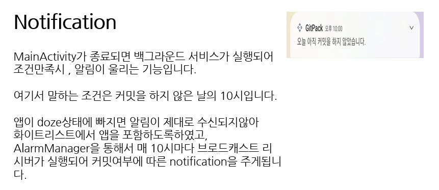

# gitpack 개인 안드로이드 프로젝트 앱소개
잊지 않고 매일 매일 커밋하는것은 어렵습니다.  
이를 잊지 않고 커밋을 하지 않은 날은 10시에 알림이 울리게 됩니다.   

커밋하는 습관을 길러주고 자신의 깃허브 캘린더를 확인하며 늘어난 초록색들을 보고 만족하게 될 것입니다.  

깃허브 비밀번호 필요없이 아이디만 입력하면 앱의 모든 기능을 사용할 수 있습니다.

# 앱 화면 

# Build with
+ github GraphQL & REST API (retrofit2 , okhttp , apollo)
+ android jetpack(recylcerView,live data, bottom navigation)
+ MVVM (적용중)
+ Material Design
+ MPAndroid Chart
+ huanghaibin-dev / CalendarView(china opensource)
+ kotlin     
  
# 제작기간 
2022.07.29 ~ 2022.09.10

# 깃 커밋 규칙
> ### 커밋 유형
> + FEAT : 새로운 기능 추가
> + FIX : 버그 수정
> + DOCS : 문서 수정
> + REFACTOR : 코드 리팩토링
> + TEST : 테스트 코드 추가
### 1. 커밋 유형 지정
### 2. 제목 행을 50자로 제한
### 3. 제목 행의 첫글자는 대문자로 시작
### 4. 제목 행에 명령문을 사용한다.  